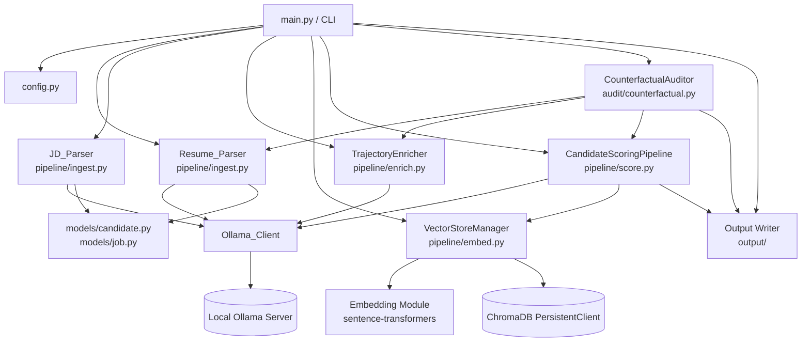
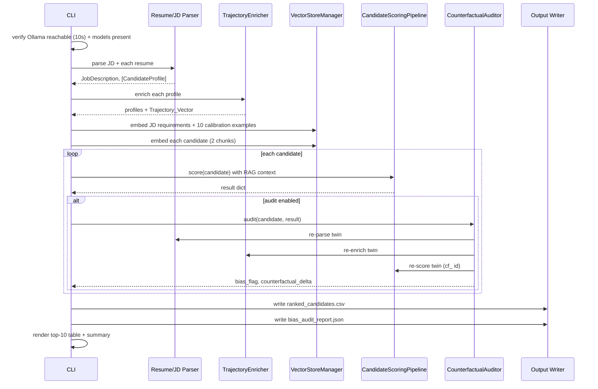
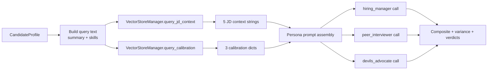
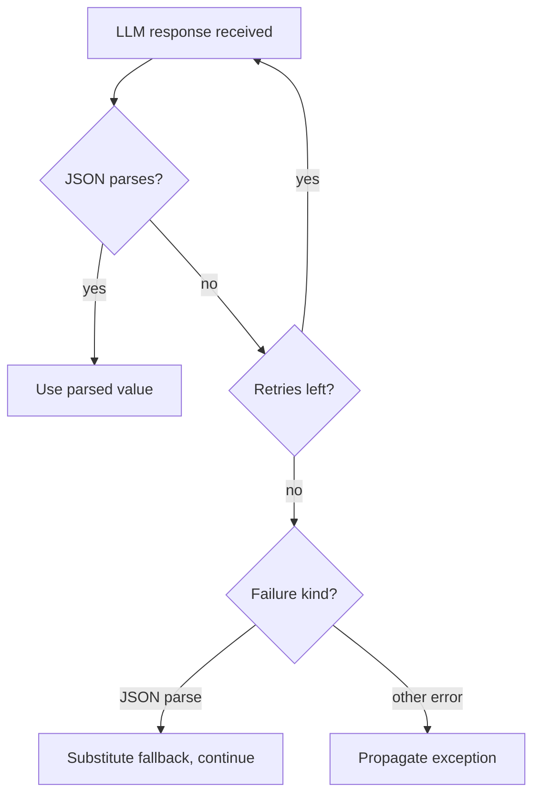

# Design Document

## Overview

The Candidate Ranking System is a local-first, command-line pipeline that turns a directory of resumes and a single job description into a ranked, bias-audited candidate report. Every inference and storage concern is satisfied by free, open-source components running on the operator's machine: a locally hosted Ollama server for LLM inference, a local `sentence-transformers` model for embeddings, and an on-disk ChromaDB store for vectors. After the initial model downloads, no network access, API keys, or paid services are required.

The pipeline runs five phases in strict sequence:

1. **INGEST** — Parse each resume into a `CandidateProfile` and the job description into a `JobDescription`.
2. **ENRICH** — Compute a career `Trajectory_Vector` (deterministic metrics + an LLM-derived seniority score) for each candidate.
3. **EMBED & STORE** — Embed job requirements, candidate chunks, and calibration examples into three ChromaDB collections.
4. **SCORE** — Evaluate each candidate through a three-persona panel with RAG context, producing a clamped composite score, panel variance, narrative, and verdicts.
5. **COUNTERFACTUAL FAIRNESS AUDIT** — Build a demographically swapped twin of each candidate, re-score it, and flag scoring deltas that exceed the bias threshold.

The system emits two artifacts: `ranked_candidates.csv` (the ranked report) and `bias_audit_report.json` (the fairness audit).

This design covers the architecture, component responsibilities and interfaces, data models, the RAG/scoring/audit data flows, the cross-cutting Ollama and embedding utilities, error handling, and a testing strategy that maps directly to the correctness properties.

### Design Goals and Rationale

- **Determinism under test.** All non-deterministic surfaces (LLM calls) flow through a single `Ollama_Client` wrapper so they can be mocked at one seam (`ollama.chat`). Pure logic (scoring math, ranking, swaps, variance) is isolated from I/O so it can be property-tested without a server (Requirement 12).
- **Single source of configuration.** Every tunable constant lives in `config.py`; no module redefines those constants (Requirement 10.5).
- **Graceful degradation.** Per-file and per-persona failures are contained: the pipeline skips a bad resume or substitutes a default verdict rather than aborting the whole run (Requirements 2, 6, 7). Only JSON-parse failures get fallback values; all other exceptions propagate (Requirement 13.9, 13.10).
- **Backend focus.** The bundled Stitch HTML/PNG mockups describe a future RankAI dashboard and are treated as domain reference only. This design specifies the Python backend that produces the CSV and JSON the dashboard would later consume.

## Architecture

### High-Level Component Map



### Phase Pipeline Sequence



### Repository Layout

```
RankAI/
├── main.py                     # CLI entry point (argparse, orchestration, rich output)
├── config.py                   # All tunable constants (single source of truth)
├── requirements.txt            # Pinned dependency manifest
├── methodology.md              # Scoring + audit methodology writeup
├── README.md                   # Setup and usage
├── pipeline/
│   ├── ingest.py               # Resume_Parser, JD_Parser
│   ├── enrich.py               # TrajectoryEnricher
│   ├── embed.py                # VectorStoreManager + embedding helpers
│   └── score.py                # CandidateScoringPipeline
├── audit/
│   └── counterfactual.py       # CounterfactualAuditor
├── personas/
│   ├── hiring_manager.txt      # Persona system prompts (text, not config)
│   ├── peer_interviewer.txt
│   └── devils_advocate.txt
├── models/
│   ├── candidate.py            # CandidateRole, CandidateProfile (Pydantic v2)
│   └── job.py                  # JobRequirement, JobDescription (Pydantic v2)
├── output/
│   └── writer.py               # Ranked CSV + audit JSON writers
├── data/
│   ├── sample_candidates.json  # 15 sample profiles across 5 categories
│   └── sample_job_description.json
└── tests/
    ├── test_ingest.py
    ├── test_embed.py
    └── test_score.py
```

### Layering and Dependency Direction

The system is organized into four layers, with dependencies pointing downward only:

- **Orchestration layer** (`main.py`) — wires phases together, owns CLI parsing, progress display, and startup verification.
- **Pipeline layer** (`pipeline/`, `audit/`, `output/`) — domain logic for each phase.
- **Utility layer** (`Ollama_Client`, embedding module) — cross-cutting wrappers for the two external dependencies (LLM, embedding model).
- **Model + config layer** (`models/`, `config.py`) — Pydantic schemas and constants depended on by everything above.

This direction keeps the pure scoring/audit/ranking logic independent of the LLM and embedding I/O, which is what makes property-based testing feasible (Requirement 12.5–12.7).

## Cross-Cutting Components

### Ollama_Client (LLM Wrapper)

A single class that wraps **all** `ollama.chat` calls. No other module calls `ollama.chat` directly (Requirement 13.6, 1.1).

Responsibilities:
- Issue chat completions against the configured `OLLAMA_HOST` and `OLLAMA_MODEL`.
- Retry on failure (exception raised or no response) up to 2 additional times, with exponential backoff implemented via `time.sleep`, starting at 1s and doubling (1s, then 2s) before each retry (Requirement 13.7).
- Raise an exception indicating all attempts failed when the initial call plus both retries are exhausted (Requirement 13.8).
- Emit request and response detail at DEBUG level (Requirement 13.6).
- Provide a JSON-parsing helper that strips markdown code fences (```json ... ```), parses JSON, and on **parse failure only** returns a caller-supplied fallback value; any non-parse exception propagates (Requirement 13.9, 13.10).

Interface:

```python
class OllamaClient:
    def __init__(self, host: str, model: str) -> None: ...

    def chat(
        self,
        messages: list[dict[str, str]],
        *,
        temperature: float | None = None,
        max_tokens: int | None = None,
    ) -> str:
        """Call ollama.chat with retry/backoff. Returns the response content string.

        Raises:
            OllamaCallError: when the initial attempt and both retries fail.
        """

    def chat_json(
        self,
        messages: list[dict[str, str]],
        *,
        fallback: dict | list,
        temperature: float | None = None,
        max_tokens: int | None = None,
    ) -> dict | list:
        """Call chat() then parse JSON (stripping markdown fences).

        On JSON-parse failure only, returns `fallback`. Other exceptions propagate.
        """
```

The retry/backoff and JSON fence-stripping logic is the most reused behavior in the system; centralizing it means each consuming component (Resume_Parser, JD_Parser, TrajectoryEnricher, CandidateScoringPipeline) only decides what fallback to pass, not how to retry or parse.

### Embedding Module

A lazy-loaded singleton `SentenceTransformer` plus a thin `embed_text` helper, so the (heavy) model is loaded at most once per process and never at import time.

Interface:

```python
def get_embedding_model() -> SentenceTransformer:
    """Return the process-wide SentenceTransformer singleton, loading it on first use."""

def embed_text(text: str) -> list[float]:
    """Embed a single string with normalize_embeddings=True. Returns the dense vector."""

def embed_texts(texts: list[str]) -> list[list[float]]:
    """Embed a batch of strings with normalize_embeddings=True."""
```

All embeddings use `normalize_embeddings=True` so cosine similarity in ChromaDB behaves consistently (Requirement 5.2). The model is `EMBEDDING_MODEL` (`BAAI/bge-large-en-v1.5`) from config (Requirement 1.2).

## Components and Interfaces

### Resume_Parser (`pipeline/ingest.py`)

Converts a resume file into a validated `CandidateProfile`.

Behavior by extension:
- `.pdf` → extract raw text with PyMuPDF (Requirement 2.1).
- `.docx` → extract raw text with python-docx (Requirement 2.2).
- `.json` → load a structured profile directly, no LLM, and set a completion flag indicating success (Requirement 2.4).
- Other extensions → log a warning, skip, continue (Requirement 2.8).

For `.pdf`/`.docx`, after text extraction the parser calls `Ollama_Client` to extract a structured profile JSON (Requirement 2.3). It then:
- Assigns `candidate_id` via `uuid4` (Requirement 2.5).
- If the LLM did not yield a name or email, runs a spaCy `en_core_web_sm` fallback to recover name/email; any field still unresolved gets its defined default (Requirement 2.6).
- Fills any missing optional field with its model default (Requirement 2.7).
- Validates against the Pydantic v2 model (Requirement 2.9); on failure, retries extraction once with a correction prompt (Requirement 2.10); on a second failure, logs a warning, skips, and continues (Requirement 2.11).
- If `.pdf`/`.docx` text is empty/whitespace-only, or a `.json` file is structurally invalid, logs a warning, skips, and continues (Requirement 2.12).

Interface:

```python
class ResumeParser:
    def __init__(self, ollama_client: OllamaClient) -> None: ...

    def parse_file(self, path: Path) -> CandidateProfile | None:
        """Parse one resume file. Returns a validated profile, or None if skipped."""

    def parse_text(self, raw_text: str, source_path: Path) -> CandidateProfile | None:
        """Extract a profile from raw resume text via LLM (used by re-parse in audit)."""
```

`parse_text` is exposed so the `CounterfactualAuditor` can re-parse a swapped resume body without touching the filesystem.

### JD_Parser (`pipeline/ingest.py`)

Converts a job description into a validated `JobDescription`.

Behavior by extension:
- `.txt` → call `Ollama_Client` to classify content into requirement buckets and dimensions (Requirement 3.1).
- `.json` → load the structured model directly, no LLM (Requirement 3.2).
- Other extensions → report an error for the unsupported extension and produce no `JobDescription` (Requirement 3.3).

Additional behavior:
- A corrupted/invalid `.json` halts with an error, produces no model, and does **not** invoke the LLM (Requirement 3.4).
- Classifies into buckets `must_have`, `nice_to_have`, `culture_signal`, `seniority_marker` (Requirement 3.5) and dimensions `technical`, `soft_skill`, `domain`, `experience_level` (Requirement 3.6).
- Assigns `job_id` via `uuid5` on the file path (Requirement 3.7).
- Validates against the Pydantic v2 model (Requirement 3.8).
- If LLM classification returns malformed JSON after `Ollama_Client` retries are exhausted, applies defined fallback values and produces a model that still validates (Requirement 3.9).

Interface:

```python
class JdParser:
    def __init__(self, ollama_client: OllamaClient) -> None: ...

    def parse_file(self, path: Path) -> JobDescription:
        """Parse the job description file. Raises on unsupported/corrupt input."""
```

### TrajectoryEnricher (`pipeline/enrich.py`)

Computes a `Trajectory_Vector` and attaches it to the profile.

Deterministic metrics (Requirement 4.1, 4.5):
- `growth_rate` ∈ [0.0, 1.0], default `0.0` when `years_experience == 0`.
- `leadership_progression` ∈ [0.0, 1.0], default `0.0` when zero roles.
- `tenure_consistency` ∈ [0.0, 1.0], default `1.0` when zero roles.
- `complexity_arc` ∈ {`ascending`, `descending`, `stable`, `mixed`}, default `stable` when fewer than 2 distinct `company_size_estimate` values.

LLM-derived metric (Requirement 4.2–4.4):
- `seniority_score` ∈ [0, 10] via `Ollama_Client`, clamped to range; defaults to `5.0` if it cannot be parsed, without raising.

Interface:

```python
class TrajectoryEnricher:
    def __init__(self, ollama_client: OllamaClient) -> None: ...

    def enrich(self, profile: CandidateProfile) -> CandidateProfile:
        """Compute the Trajectory_Vector and attach it to the profile (returned)."""

    def compute_growth_rate(self, roles: list[CandidateRole], years: float) -> float: ...
    def compute_complexity_arc(self, roles: list[CandidateRole]) -> str: ...
    def compute_leadership_progression(self, roles: list[CandidateRole]) -> float: ...
    def compute_tenure_consistency(self, roles: list[CandidateRole]) -> float: ...
```

The four `compute_*` methods are pure functions of their inputs (no I/O), which makes the trajectory defaults directly unit-testable.

### VectorStoreManager (`pipeline/embed.py`)

Owns the three ChromaDB collections and all embedding injection.

On init, creates three collections each with `embedding_function=None` (Requirement 5.1, 1.3):
- `jd_requirements`
- `candidate_profiles`
- `calibration_examples`

Storage (Requirement 5.2, 5.3, 5.7):
- Computes embeddings with the Embedding_Model and **manually injects** vectors (`embeddings=[...]`) into ChromaDB.
- Stores each candidate as exactly two chunks in `candidate_profiles`: a `profile_summary` chunk and a `skills` chunk, each with metadata `candidate_id` and `chunk_type`.
- On embedding-computation failure during a store, aborts the store, leaves the target collection unchanged, and reports an embedding-failure error.

Retrieval (Requirement 5.4, 5.5):
- `query_jd_context` embeds the query via `query_embeddings` and returns up to the 5 most similar JD context document strings, descending by similarity.
- `query_calibration` embeds the query via `query_embeddings` and returns up to the 3 most similar calibration metadata dicts (`outcome`, `reason`), descending by similarity.

Calibration loading (Requirement 5.6): stores exactly 10 calibration examples, 5 `strong_hire` + 5 `no_hire`, sourced from `config.CALIBRATION_EXAMPLES`.

Interface:

```python
class VectorStoreManager:
    def __init__(self, persist_dir: str) -> None: ...

    def embed_job_description(self, jd: JobDescription) -> None: ...
    def embed_calibration_examples(self, examples: list[dict]) -> None: ...
    def embed_candidate(self, profile: CandidateProfile) -> None:
        """Store the profile as profile_summary + skills chunks. Raises EmbeddingError on failure."""

    def query_jd_context(self, query: str, n: int = 5) -> list[str]: ...
    def query_calibration(self, query: str, n: int = 3) -> list[dict]: ...
```

### CandidateScoringPipeline (`pipeline/score.py`)

Scores a candidate via the three-persona panel with RAG context.

Persona system prompts are loaded from `personas/*.txt` (text files, not config) for `hiring_manager`, `peer_interviewer`, `devils_advocate` (Requirement 6.1).

Per candidate:
1. Build a query from the candidate's profile/skills and retrieve 5 JD context items + 3 calibration items from the `VectorStoreManager` (Requirement 6.2).
2. Run the three persona Ollama calls **sequentially**, each producing a persona score ∈ [0, 10] and a verdict (Requirement 6.1).
   - If a persona response is not valid JSON, retry that persona once (Requirement 6.8).
   - If still unparseable, substitute the defined default verdict result (including default persona score) and continue (Requirement 6.9).
3. Compute `Composite_Score` = weighted sum (`0.45*hiring_manager + 0.35*peer_interviewer - 0.20*devils_advocate`), rounded to 2 decimals (Requirement 6.3), then clamped to [0, 10] (Requirement 6.4).
4. Compute `Panel_Variance` = population variance of the three persona scores (mean of squared deviations from the mean) (Requirement 6.5).
5. Set `requires_human_review = (Panel_Variance > 2.5)` (Requirement 6.6, 6.7).
6. Generate a narrative of exactly three sentences via an Ollama call (Requirement 6.10).
7. Return the full result dict (Requirement 6.11) with deduplicated strengths/concerns.

Interface:

```python
class CandidateScoringPipeline:
    def __init__(self, ollama_client: OllamaClient, store: VectorStoreManager) -> None: ...

    def score(self, profile: CandidateProfile) -> dict:
        """Score one candidate. Returns the full result dict (see Data Models)."""

    @staticmethod
    def composite_score(persona_scores: dict[str, float]) -> float:
        """Weighted sum, rounded to 2 decimals and clamped to [0, 10]. Pure function."""

    @staticmethod
    def panel_variance(persona_scores: dict[str, float]) -> float:
        """Population variance of the three persona scores. Pure function."""
```

`composite_score` and `panel_variance` are static pure functions — these are the two property-tested surfaces (Requirement 12.9, 12.10).

### CounterfactualAuditor (`audit/counterfactual.py`)

Builds a demographically swapped twin and re-scores it to detect bias.

Twin construction (Requirement 7.1): swap the candidate name using `COUNTERFACTUAL_NAME_PAIRS`, swap gendered pronouns (he/him/his ↔ she/her/hers, whole-word and case-insensitive), and swap institutions using `INSTITUTION_SWAPS`. Any name/pronoun/institution token without a configured swap is left unchanged.

Re-evaluation (Requirement 7.2): re-parse and re-enrich the twin, then re-score it through the **same** `CandidateScoringPipeline` and `VectorStoreManager`, assigning `candidate_id = "cf_" + original_id`.

Delta and flag (Requirement 7.3–7.5): `Counterfactual_Delta = round(abs(original_composite - twin_composite), 2)`; `Bias_Flag = (delta > 0.75)`.

Result handling (Requirement 7.6, 7.9): update the original result in place with `bias_flag` and `counterfactual_delta`, append to `AUDIT_LOG`. If re-parse/re-enrich/re-score fails, record an audit-failure entry, do **not** set `Bias_Flag` true, and continue with remaining candidates.

Reporting (Requirement 7.7, 7.8): write `bias_audit_report.json` with total audited, flagged count, flag rate (flagged/total, 0 when total is 0), threshold, flagged candidates, clean count, and a methodology note. When skipped (Requirement 7.8 / 9.10), write a report documenting that no bias analysis was performed.

Interface:

```python
class CounterfactualAuditor:
    def __init__(
        self,
        parser: ResumeParser,
        enricher: TrajectoryEnricher,
        scorer: CandidateScoringPipeline,
    ) -> None: ...

    def build_twin(self, profile: CandidateProfile) -> str:
        """Return swapped resume text for the twin (name/pronoun/institution swaps)."""

    def audit(self, profile: CandidateProfile, result: dict) -> dict:
        """Score the twin, update `result` in place, append to AUDIT_LOG. Returns the audit entry."""

    @staticmethod
    def swap_pronouns(text: str) -> str:
        """Whole-word, case-insensitive gendered pronoun swap. Pure function."""

    @staticmethod
    def swap_tokens(text: str, mapping: dict[str, str]) -> str:
        """Whole-word swap of names/institutions using `mapping`. Pure function."""

    def write_report(self, output_dir: Path, skipped: bool = False) -> Path: ...
```

### Output Writer (`output/writer.py`)

Produces the two artifacts.

Ranked CSV (Requirement 8.1–8.7):
- Sort by `composite_score` descending, tie-break by `candidate_id` ascending (Requirement 8.1).
- Assign consecutive ranks starting at 1 (Requirement 8.2).
- Write with pandas to `ranked_candidates.csv` (Requirement 8.3).
- Fixed column order; `strengths`/`concerns` pipe-separated with empty list → empty string (Requirement 8.4).
- `verdict_consensus` = the verdict held by ≥2 of 3 personas, else the `hiring_manager` verdict (Requirement 8.5, 8.6).
- On write failure, report an error and exit leaving no partial CSV (write to a temp path then atomically rename) (Requirement 8.7).

Audit JSON: delegated to / shared with `CounterfactualAuditor.write_report` to produce `bias_audit_report.json`.

Interface:

```python
def rank_candidates(results: list[dict]) -> list[dict]:
    """Sort + assign consecutive ranks. Pure function."""

def verdict_consensus(persona_verdicts: dict[str, str]) -> str:
    """Majority verdict, else hiring_manager's verdict. Pure function."""

def write_ranked_csv(results: list[dict], output_dir: Path) -> Path:
    """Write ranked_candidates.csv atomically (no partial file on failure)."""
```

### CLI (`main.py`)

Orchestrates the run.

- argparse flags: `--candidates-dir`, `--job-description`, `--output-dir`, `--skip-audit`, `--verbose` (Requirement 9.1).
- Startup: verify Ollama reachable within a 10s connection timeout via `ollama.list()`; on failure report setup instructions and exit (Requirement 9.2, 9.3). Also verify the LLM and Embedding_Model are present locally; on missing models, name each and exit without running any phase or writing artifacts (Requirement 1.7, 1.8).
- Load + parse the JD and candidate files (`.json`, `.pdf`, `.docx`); if the candidates dir is missing or empty, fall back to `data/sample_candidates.json` (Requirement 9.4, 9.5).
- Embed JD + calibration examples before scoring (Requirement 9.6).
- Show a rich progress bar over the candidate count while scoring (Requirement 9.7).
- After scoring, render a rich table of the top 10 (or all, if fewer) by composite score showing rank, name, composite_score, verdict_consensus, requires_human_review, bias_flag (Requirement 9.8).
- Print a summary: total candidates, elapsed seconds, output paths (Requirement 9.9).
- `--skip-audit` runs without the audit (Requirement 9.10); `--verbose` → DEBUG logging, otherwise INFO+ (Requirement 9.11, 9.12).
- Emit INFO logs at phase begin/end and per-candidate completion (Requirement 13.5); route all output through `logging`, never `print` (Requirement 13.4).

### Config (`config.py`)

Single source of truth for all tunable constants (Requirement 10):
- `OLLAMA_MODEL` (`llama3.2:3b`), `OLLAMA_HOST`, `EMBEDDING_MODEL` (`BAAI/bge-large-en-v1.5`), `CHROMA_PERSIST_DIR`.
- Token limits `extraction`, `scoring`, `narrative` (each a positive int), `SCORING_TEMPERATURE` ∈ [0.0, 1.0].
- `PERSONA_WEIGHTS` = {hiring_manager: 0.45, peer_interviewer: 0.35, devils_advocate: -0.20}, `BIAS_FLAG_THRESHOLD` = 0.75, `HUMAN_REVIEW_VARIANCE_THRESHOLD` = 2.5.
- `TITLE_LEVELS`, `COUNTERFACTUAL_NAME_PAIRS`, `INSTITUTION_SWAPS` (each ≥1 entry).
- `CALIBRATION_EXAMPLES` = exactly 5 `strong_hire` + 5 `no_hire`.

No module outside `config.py` redefines these constants (prompt text and persona files excepted) (Requirement 10.5).

## Data Models

All models are Pydantic v2. Optional fields carry explicit defaults so a partial source still produces a valid model (Requirements 2.7, 11.4).

### CandidateRole (`models/candidate.py`)

```python
class CandidateRole(BaseModel):
    """One employment entry in a candidate's history."""
    title: str
    company: str
    start_date: date
    end_date: date | None = None          # None => current role
    duration_months: int = 0
    company_size_estimate: str | None = None   # used for complexity_arc
    is_leadership: bool = False
    responsibilities: list[str] = Field(default_factory=list)
```

Constraint (sample data, Requirement 11.5): for each role, `start_date <= end_date` and `duration_months` equals the whole number of months between the two dates.

### CandidateProfile (`models/candidate.py`)

```python
class TrajectoryVector(BaseModel):
    """Computed career-trajectory metrics attached during ENRICH."""
    growth_rate: float = 0.0                 # [0.0, 1.0]
    complexity_arc: str = "stable"           # ascending|descending|stable|mixed
    leadership_progression: float = 0.0      # [0.0, 1.0]
    tenure_consistency: float = 1.0          # [0.0, 1.0]
    seniority_score: float = 5.0             # [0, 10]

class CandidateProfile(BaseModel):
    """A candidate's structured profile."""
    candidate_id: str                        # uuid4 (or cf_<id> for twins)
    name: str = "Unknown Candidate"
    email: str = ""
    years_experience: float = 0.0
    skills: list[str] = Field(default_factory=list)
    roles: list[CandidateRole] = Field(default_factory=list)
    education: list[str] = Field(default_factory=list)
    summary: str = ""
    raw_text: str = ""                       # original resume text (used by audit re-parse)
    trajectory: TrajectoryVector | None = None
    is_complete: bool = False                # completion flag set on successful build
```

### JobRequirement (`models/job.py`)

```python
class JobRequirement(BaseModel):
    """One classified job requirement."""
    text: str
    bucket: str          # must_have | nice_to_have | culture_signal | seniority_marker
    dimension: str       # technical | soft_skill | domain | experience_level
```

### JobDescription (`models/job.py`)

```python
class JobDescription(BaseModel):
    """The parsed job description with classified requirements."""
    job_id: str                              # uuid5 on file path
    title: str = "Untitled Role"
    company: str = ""
    raw_text: str = ""
    requirements: list[JobRequirement] = Field(default_factory=list)

    def by_bucket(self, bucket: str) -> list[JobRequirement]:
        """Return requirements in the given bucket."""

    def context_strings(self) -> list[str]:
        """Render requirements to strings for embedding/RAG."""
```

### Score Result Dict

The `CandidateScoringPipeline.score` return value (Requirement 6.11) and the basis for the CSV rows (Requirement 8.4):

```python
{
    "candidate_id": str,
    "name": str,
    "trajectory_score": float,        # seniority_score from Trajectory_Vector
    "hiring_manager_score": float,    # [0, 10]
    "peer_interviewer_score": float,  # [0, 10]
    "devils_advocate_score": float,   # [0, 10]
    "composite_score": float,         # rounded(2), clamped [0, 10]
    "panel_variance": float,          # population variance
    "requires_human_review": bool,    # variance > 2.5
    "persona_verdicts": dict,         # {persona: verdict}
    "strengths": list[str],           # de-duplicated
    "concerns": list[str],            # de-duplicated
    "narrative": str,                 # exactly 3 sentences
    "bias_flag": bool,                # set by auditor (default False)
    "counterfactual_delta": float,    # set by auditor (default 0.0)
}
```

### Audit Report (`bias_audit_report.json`)

```python
{
    "total_audited": int,
    "flagged_count": int,
    "flag_rate": float,               # flagged/total, 0 when total == 0
    "bias_threshold": float,          # 0.75
    "flagged_candidates": list[dict], # candidate_id, name, counterfactual_delta
    "clean_count": int,
    "methodology_note": str,
    "audit_failures": list[dict],     # candidates whose twin scoring failed
}
```

When the audit is skipped, the report instead documents that no bias analysis was performed (Requirement 7.8).

### Data Flow: RAG Context Assembly



## Correctness Properties

*A property is a characteristic or behavior that should hold true across all valid executions of a system — essentially, a formal statement about what the system should do. Properties serve as the bridge between human-readable specifications and machine-verifiable correctness guarantees.*

This system is well suited to property-based testing because its core is pure logic with large input spaces: scoring math, panel-variance thresholds, ranking, text swaps, and validation defaults. All LLM I/O is isolated behind `Ollama_Client` and mocked, so these properties are tested deterministically and offline (Requirement 12.5–12.8).

Two of the properties below are explicitly required by the requirements: the composite-clamping property (Requirement 12.9) and the panel-variance human-review trigger (Requirement 12.10). The remaining properties provide comprehensive coverage of the testable acceptance criteria; criteria classified as INTEGRATION, SMOKE, EXAMPLE, or EDGE_CASE in the prework are covered by the unit and integration tests described in the Testing Strategy rather than by property tests.

### Property 1: Parsed profiles validate with defaults populated

*For any* resume source with an arbitrary subset of optional fields omitted, the `CandidateProfile` returned by the Resume_Parser validates against the Pydantic v2 model with the defined default value populated for every omitted optional field.

**Validates: Requirements 2.7, 2.9, 12.1**

### Property 2: JD classification covers all buckets and uses valid dimensions

*For any* successfully classified job description, the resulting `JobDescription` contains at least one requirement in each bucket (`must_have`, `nice_to_have`, `culture_signal`, `seniority_marker`), and every requirement's dimension is one of `technical`, `soft_skill`, `domain`, `experience_level`.

**Validates: Requirements 3.5, 3.6, 12.2**

### Property 3: JobDescription always validates, including on malformed classification

*For any* job-description classification response — including malformed JSON that exhausts the `Ollama_Client` retries — the JD_Parser produces a `JobDescription` that validates against the Pydantic v2 model (using the defined fallback values when classification fails).

**Validates: Requirements 3.8, 3.9**

### Property 4: job_id is a deterministic uuid5 of the file path

*For any* job-description file path, the assigned `job_id` equals `uuid5` of that path and is identical across repeated runs on the same path.

**Validates: Requirements 3.7**

### Property 5: Trajectory metrics stay in range and are attached

*For any* `CandidateProfile`, after enrichment the profile has a non-null `Trajectory_Vector` whose `growth_rate`, `leadership_progression`, and `tenure_consistency` lie in [0.0, 1.0] and whose `complexity_arc` is one of `ascending`, `descending`, `stable`, `mixed`.

**Validates: Requirements 4.1, 4.6**

### Property 6: Degenerate trajectory inputs map to defined defaults

*For any* `CandidateProfile` with degenerate history, the affected metric takes its defined default: zero roles → `tenure_consistency` = 1.0, `growth_rate` = 0.0, `leadership_progression` = 0.0, `complexity_arc` = `stable`; `years_experience` = 0 → `growth_rate` = 0.0; fewer than 2 distinct `company_size_estimate` values → `complexity_arc` = `stable`.

**Validates: Requirements 4.5**

### Property 7: Seniority score is clamped to [0, 10]

*For any* value parsed (or defaulted) from the `Ollama_Client` seniority response, the resulting `seniority_score` lies in the inclusive range [0, 10].

**Validates: Requirements 4.2, 4.3**

### Property 8: A candidate is stored as exactly two labeled chunks

*For any* `CandidateProfile`, embedding it adds exactly two entries to the `candidate_profiles` collection — one `profile_summary` chunk and one `skills` chunk — each carrying metadata `candidate_id` (the candidate's id) and `chunk_type`.

**Validates: Requirements 5.3, 12.3**

### Property 9: Calibration store holds exactly ten balanced examples

*For any* initialization of the Vector_Store from `config.CALIBRATION_EXAMPLES`, the `calibration_examples` collection contains exactly 10 entries, comprising 5 labeled `strong_hire` and 5 labeled `no_hire`.

**Validates: Requirements 5.6, 12.3**

### Property 10: JD retrieval returns at most five items ordered by similarity

*For any* query against the JD retrieval method, the result is a list of at most 5 context document strings ordered by non-increasing embedding similarity.

**Validates: Requirements 5.4**

### Property 11: Calibration retrieval returns at most three well-formed items ordered by similarity

*For any* query against the calibration retrieval method, the result is a list of at most 3 metadata dicts, each containing `outcome` and `reason`, ordered by non-increasing embedding similarity.

**Validates: Requirements 5.5**

### Property 12: Each persona score is in [0, 10]

*For any* set of mocked persona responses, each of the three persona scores produced by the scoring pipeline lies in the inclusive range [0, 10].

**Validates: Requirements 6.1**

### Property 13: Composite score is the rounded weighted sum clamped to [0, 10]

*For any* combination of three persona scores, the `Composite_Score` equals the weighted sum `0.45·hiring_manager + 0.35·peer_interviewer − 0.20·devils_advocate` rounded to 2 decimal places and then clamped, and the final value always lies in the inclusive range [0, 10].

**Validates: Requirements 6.3, 6.4, 12.9**

### Property 14: Panel variance is population variance and drives human review

*For any* three persona scores, the `Panel_Variance` equals the population variance (the mean of the squared deviations from their mean), and `requires_human_review` is true if and only if `Panel_Variance` is strictly greater than 2.5.

**Validates: Requirements 6.5, 6.6, 6.7, 12.10**

### Property 15: Score result is schema-complete with deduplicated lists

*For any* scored candidate, the result dict contains all required keys (`candidate_id`, `name`, `trajectory_score`, the three persona scores, `composite_score`, `panel_variance`, `requires_human_review`, `persona_verdicts`, `strengths`, `concerns`, `narrative`, `bias_flag`, `counterfactual_delta`), and the `strengths` and `concerns` lists contain no duplicate entries.

**Validates: Requirements 6.11, 12.4**

### Property 16: Counterfactual swaps are whole-word, case-insensitive, and leave unconfigured tokens unchanged

*For any* input text, the twin-construction transform replaces every configured name, gendered pronoun (he/him/his ↔ she/her/hers), and institution on whole-word, case-insensitive boundaries, while leaving any name, pronoun, or institution token without a configured swap unchanged.

**Validates: Requirements 7.1**

### Property 17: The twin reuses the same store with a cf_-prefixed id

*For any* audited candidate, the Counterfactual_Twin is scored against the same Vector_Store and is assigned `candidate_id` equal to the original candidate_id prefixed with `cf_`.

**Validates: Requirements 7.2**

### Property 18: Counterfactual delta is a non-negative rounded difference that drives the bias flag

*For any* original and twin composite scores from a successful audit, the `Counterfactual_Delta` equals `round(abs(original − twin), 2)` and is greater than or equal to 0, and the `Bias_Flag` is true if and only if the delta is strictly greater than 0.75.

**Validates: Requirements 7.3, 7.4, 7.5, 12.4**

### Property 19: Flag rate equals flagged over total

*For any* audit log, the reported `flag_rate` equals the flagged count divided by the total audited count, and equals 0 when the total audited count is 0.

**Validates: Requirements 7.7**

### Property 20: Ranking is correctly ordered with consecutive ranks

*For any* set of scored candidate results, the ranked output is ordered by `composite_score` descending with ties broken by `candidate_id` ascending, and the assigned ranks are the consecutive integers 1..N with no gaps in sorted order.

**Validates: Requirements 8.1, 8.2**

### Property 21: CSV encoding has fixed columns and correct list serialization

*For any* set of scored candidate results, the written CSV has exactly the defined columns in the defined order, one data row per candidate, with `strengths` and `concerns` serialized as pipe-separated values and an empty list serialized as an empty string.

**Validates: Requirements 8.4**

### Property 22: Verdict consensus is the majority, else the hiring manager's verdict

*For any* set of three persona verdicts, `verdict_consensus` is the verdict held by at least two personas when such a majority exists, and otherwise is the `hiring_manager` persona's verdict.

**Validates: Requirements 8.5, 8.6**

### Property 23: Sample role dates are consistent with duration

*For all* employment entries in the sample candidate data, the role's `start_date` is on or before its `end_date`, and `duration_months` equals the whole number of months between `start_date` and `end_date`.

**Validates: Requirements 11.5**

### Property 24: chat_json falls back on non-JSON without raising

*For any* response string that is not valid JSON (after markdown-fence stripping), `Ollama_Client.chat_json` returns the caller-supplied fallback value and does not raise.

**Validates: Requirements 13.9**

## Error Handling

The system distinguishes three error postures: **skip-and-continue** (per-item resilience), **substitute-and-continue** (per-call resilience for JSON parse failures), and **fail-fast** (whole-run guards). The governing rule from Requirement 13.9–13.10 is: only JSON-parse failures get fallback values; every other exception propagates.

### Startup Guards (fail-fast)

| Condition | Handling | Requirement |
|---|---|---|
| Ollama server unreachable within 10s | Report failure with setup instructions, exit before any phase | 9.2, 9.3 |
| LLM or Embedding_Model missing locally | Report naming each missing model, exit without running any phase or writing artifacts | 1.7, 1.8 |
| Unsupported JD extension | Report unsupported-extension error, produce no JobDescription | 3.3 |
| Corrupt/invalid `.json` JD | Report invalid-file error, produce no model, do not invoke the LLM | 3.4 |

### Per-Candidate Resilience (skip-and-continue)

| Condition | Handling | Requirement |
|---|---|---|
| Unsupported resume extension | Log warning, skip file, continue | 2.8 |
| Empty/whitespace resume text or invalid resume `.json` | Log warning, skip file, continue | 2.12 |
| Profile fails validation | Retry extraction once with a correction prompt | 2.10 |
| Profile fails validation after retry | Log warning, skip file, continue | 2.11 |
| Twin re-parse/re-enrich/re-score fails | Record audit-failure entry, do **not** set bias_flag true, continue auditing others | 7.9 |

### Per-Call Resilience (substitute-and-continue, JSON parse failures only)

| Condition | Handling | Requirement |
|---|---|---|
| `Ollama_Client` call fails (exception/no response) | Retry up to 2 more times, backoff 1s then 2s via `time.sleep` | 13.7 |
| All `Ollama_Client` attempts exhausted | Raise an all-attempts-failed exception | 13.8 |
| Seniority score unparseable | Default to 5.0, do not raise | 4.4 |
| JD classification malformed after retries | Apply fallback values; produced model still validates | 3.9 |
| Persona response unparseable | Retry that persona once | 6.8 |
| Persona response unparseable after retry | Substitute default verdict + default persona score, continue | 6.9 |
| Any LLM-response JSON parse failure after retries | Substitute defined fallback, continue without raising | 13.9 |
| Non-parse error while handling an LLM response | Propagate the exception (no fallback) | 13.10 |

### Output Atomicity (fail-fast, no partial artifacts)

| Condition | Handling | Requirement |
|---|---|---|
| Embedding computation fails during a store | Abort store, leave target collection unchanged, report embedding-failure error | 5.7 |
| Ranked CSV write fails | Report error and exit leaving no partial `ranked_candidates.csv` (write to temp path, then atomic rename) | 8.7 |



## Testing Strategy

### Approach

Testing follows a dual approach (Requirement 12):

- **Unit and example tests** verify specific behaviors, dispatch paths, edge cases, and error conditions.
- **Integration tests** verify infrastructure wiring (ChromaDB collection setup, manual embedding injection) with 1–3 representative cases.
- **Property-based tests** verify the universal correctness properties above across many generated inputs.

All tests are deterministic and run offline. Every `Ollama_Client` LLM call is mocked via `unittest.mock.patch` on `ollama.chat` (Requirement 12.5), so the suite makes no real Ollama or network calls (Requirement 12.6, 12.7) and produces identical results across runs (Requirement 12.8). The embedding model and ChromaDB are exercised locally (or with a lightweight fake embedding function in pure-logic tests) to keep runs fast and deterministic.

### Tooling

- **Test runner:** `pytest`.
- **Mocking:** `pytest-mock` / `unittest.mock.patch` on `ollama.chat`; `time.sleep` patched to assert backoff timing without real delays.
- **Property-based testing:** **Hypothesis** (the standard PBT library for Python). Property tests must not be hand-rolled.
- **Determinism:** Hypothesis configured with a fixed seed/profile; minimum **100 iterations** per property test (`@settings(max_examples=100)` or higher).

### Property Test Configuration

- Each property test maps to exactly one Correctness Property and is implemented as a **single** property-based test.
- Minimum 100 generated examples per property test.
- Each property test is tagged with a comment in the format:
  `# Feature: candidate-ranking-system, Property {number}: {property_text}`
- Generators target the relevant input space, e.g.:
  - Persona-score triples in [0, 10] (Properties 12, 13, 14).
  - Score triples constructed to land above and below the 2.5 variance threshold (Property 14).
  - Arbitrary text with embedded configured/unconfigured names, pronouns, and institutions (Property 16).
  - `CandidateProfile` instances with varied/empty role histories and optional-field subsets (Properties 1, 5, 6).
  - Result sets with duplicate composite scores to exercise tie-breaking (Property 20).
  - Verdict triples spanning majority and no-majority cases (Property 22).
  - Non-JSON and fenced-JSON strings (Property 24).

### Property-to-Test Mapping

| Property | Tested surface (pure unless noted) | Requirements |
|---|---|---|
| P1 Profile defaults + validity | `ResumeParser.parse_text` / `.json` load (mocked LLM) | 2.7, 2.9, 12.1 |
| P2 JD bucket coverage + dimensions | `JdParser` classification (mocked LLM) | 3.5, 3.6, 12.2 |
| P3 JD always validates incl. fallback | `JdParser.parse_file` (mocked malformed LLM) | 3.8, 3.9 |
| P4 job_id uuid5 determinism | `JdParser` id assignment | 3.7 |
| P5 Trajectory range/enum + attach | `TrajectoryEnricher.enrich` (mocked seniority) | 4.1, 4.6 |
| P6 Trajectory degenerate defaults | `compute_*` pure functions | 4.5 |
| P7 Seniority clamp | `TrajectoryEnricher` seniority parse + clamp | 4.2, 4.3 |
| P8 Two labeled chunks | `VectorStoreManager.embed_candidate` | 5.3, 12.3 |
| P9 Ten balanced calibration examples | `VectorStoreManager.embed_calibration_examples` | 5.6, 12.3 |
| P10 JD retrieval ≤5 ordered | `VectorStoreManager.query_jd_context` | 5.4 |
| P11 Calibration retrieval ≤3 ordered | `VectorStoreManager.query_calibration` | 5.5 |
| P12 Persona scores in [0,10] | `CandidateScoringPipeline.score` (mocked personas) | 6.1 |
| **P13 Composite rounded + clamped** | `CandidateScoringPipeline.composite_score` (pure) | 6.3, 6.4, **12.9** |
| **P14 Variance + human-review trigger** | `CandidateScoringPipeline.panel_variance` (pure) | 6.5, 6.6, 6.7, **12.10** |
| P15 Result schema + dedup | `CandidateScoringPipeline.score` (mocked) | 6.11, 12.4 |
| P16 Swap correctness | `CounterfactualAuditor.swap_pronouns` / `swap_tokens` (pure) | 7.1 |
| P17 Twin cf_ id + same store | `CounterfactualAuditor.audit` (mocked) | 7.2 |
| P18 Delta + bias flag | `CounterfactualAuditor` delta/flag (pure) | 7.3, 7.4, 7.5, 12.4 |
| P19 Flag rate | `CounterfactualAuditor.write_report` computation (pure) | 7.7 |
| P20 Ranking + consecutive ranks | `output.writer.rank_candidates` (pure) | 8.1, 8.2 |
| P21 CSV columns + list encoding | `output.writer.write_ranked_csv` | 8.4 |
| P22 Verdict consensus | `output.writer.verdict_consensus` (pure) | 8.5, 8.6 |
| P23 Sample role date consistency | `data/sample_candidates.json` | 11.5 |
| P24 chat_json fallback | `OllamaClient.chat_json` | 13.9 |

### Required Example / Integration / Smoke Tests

These cover criteria that are not suited to property-based testing (per prework classification):

- **`test_ingest.py`**
  - `.json` resume with omitted optional fields validates with defaults and `is_complete` true; asserts `ollama.chat` not called (Requirement 12.1, 2.4).
  - `.pdf`/`.docx` dispatch to PyMuPDF / python-docx, then LLM extraction (mocked) (Requirement 2.1, 2.2, 2.3).
  - Validation retry-once then skip paths (Requirement 2.10, 2.11); unsupported extension and empty/invalid input skip-and-continue (Requirement 2.8, 2.12).
  - JD `.txt` classification, `.json` direct load (no LLM), unsupported extension error, corrupt `.json` error with no LLM call (Requirement 3.1–3.4); classification produces ≥1 per bucket (Requirement 12.2).
  - Seniority unparseable → default 5.0 without raising (Requirement 4.4).
- **`test_embed.py`**
  - Three collections created with `embedding_function=None` (Requirement 5.1).
  - Candidate stores exactly two chunks; retrieval returns non-empty; calibration count == 10 (Requirement 12.3).
  - Embedding failure mid-store aborts and leaves the collection unchanged (Requirement 5.7).
- **`test_score.py`**
  - Result contains all required fields and `counterfactual_delta` is a float ≥ 0 (Requirement 12.4).
  - Persona JSON parse retry-once then default-verdict substitution (Requirement 6.8, 6.9).
  - Narrative reduced to exactly three sentences (Requirement 6.10).
  - RAG context assembly passes 5 JD + 3 calibration items to persona prompts (Requirement 6.2).
  - Audit: in-place update + AUDIT_LOG append (Requirement 7.6); skip-audit report content (Requirement 7.8); twin-failure handling (Requirement 7.9).
  - `Ollama_Client` retry/backoff: 3 attempts with `time.sleep` called 1s then 2s, then raise (Requirement 13.7, 13.8); non-parse error propagates (Requirement 13.10).
  - CLI: arg parsing, reachability check + failure exit, sample-data fallback, top-10 table, summary, `--skip-audit`, log levels (Requirement 9.1–9.12).
  - DEBUG request/response logging on LLM calls; INFO phase/candidate logging (Requirement 13.5, 13.6).
- **Config / quality smoke tests**
  - Config constants present with valid ranges; `CALIBRATION_EXAMPLES` is 5+5; weights/thresholds exact (Requirement 10.1–10.4).
  - Constants sourced only from `config.py` (Requirement 10.5); module docstrings, type hints, no `print` (Requirement 13.1–13.4).
  - Sample data: 15 profiles across 5 categories; sample JD validates with ≥1 per bucket (Requirement 11.1–11.4).

### What Is Deliberately Not Property-Tested

Per the prework classification, the following are covered by example/integration/smoke tests rather than property tests, because their behavior does not vary meaningfully with input or they verify external/infrastructure concerns: ChromaDB collection setup and manual injection wiring (5.1, 5.2), startup/reachability guards (1.7, 1.8, 9.2, 9.3), dependency/stack constraints (1.1–1.11), CLI rendering and logging (9.7–9.12, 13.4–13.6), retry/backoff scheduling (13.7, 13.8), and fixed sample-dataset counts (11.1–11.4).
