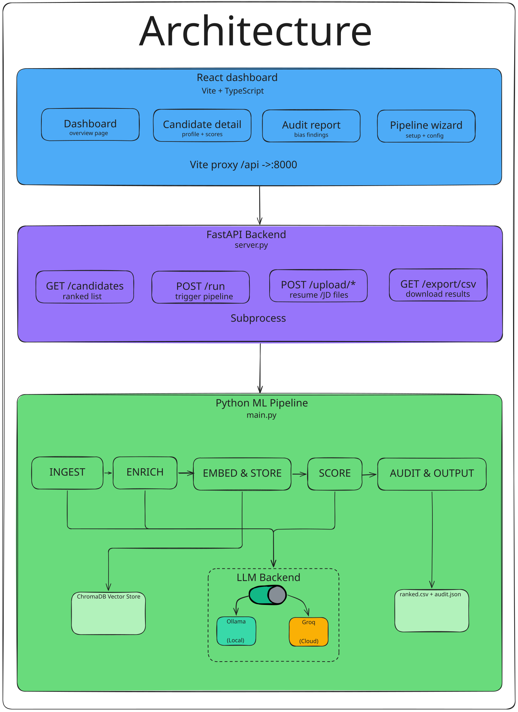
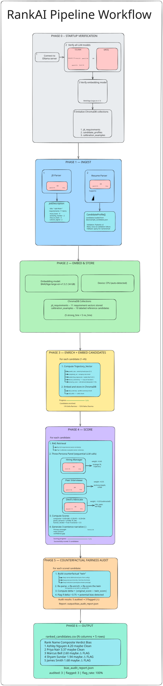
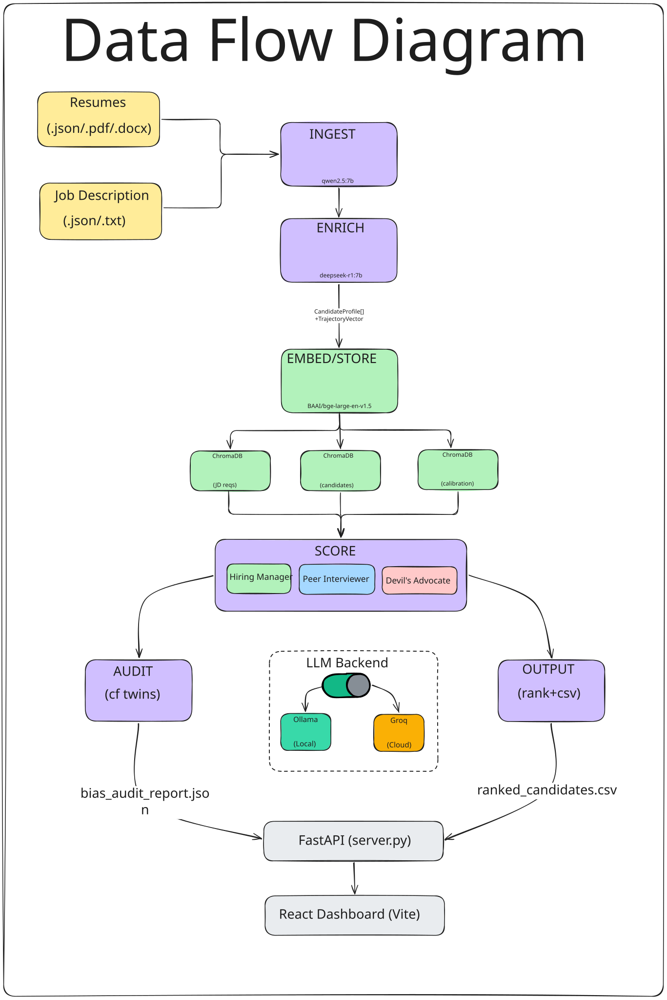

<div align="center">

# 🧠 RankAI

### Local-First, Bias-Audited AI Candidate Ranking System

[](#prerequisites)
[](#prerequisites)
[](#web-dashboard)
[](#web-dashboard)
[](./LICENSE)

**Rank candidates against any job description using a multi-model AI panel — entirely free, entirely offline, with built-in bias detection.**

[Quick Start](#quick-start) · [Architecture](#architecture) · [Pipeline Workflow](#pipeline-workflow) · [Web Dashboard](#web-dashboard) · [Methodology](./methodology.md)

</div>

---

## ✨ What Is RankAI?

RankAI evaluates candidates the way a real hiring panel would — three AI personas with different evaluation lenses score each candidate, debate, and produce a defensible ranking with full explainability. A counterfactual fairness audit then stress-tests every score for demographic sensitivity.

**Key principles:**
- 🔒 **Local-first** — Resumes never leave your machine. Zero API keys, zero cloud calls.
- 🎯 **Multi-persona scoring** — Hiring Manager, Peer Interviewer, and Devil's Advocate each evaluate independently.
- ⚖️ **Bias-audited** — Counterfactual twins detect scoring sensitivity to names, pronouns, and institutions.
- 🧩 **Multi-model routing** — Each agent uses the LLM best suited to its cognitive load.
- 📊 **Explainable** — Every score comes with strengths, concerns, a narrative, and a verdict.

---

## 📐 Architecture

[](./docs/diagrams/architecture.svg)

<details>
<summary>ASCII version</summary>

```
┌──────────────────────────────────────────────────────────────────────┐
│                      React Dashboard (Vite + TS)                     │
│  ┌───────────┐  ┌────────────────┐  ┌──────────┐  ┌──────────────┐  │
│  │ Dashboard  │  │ Candidate      │  │ Audit    │  │ Pipeline     │  │
│  │ Page       │  │ Detail Page    │  │ Report   │  │ Setup Wizard │  │
│  └───────────┘  └────────────────┘  └──────────┘  └──────────────┘  │
│                      ▼ Vite Proxy /api → :8000                       │
├──────────────────────────────────────────────────────────────────────┤
│                    FastAPI Backend (server.py)                        │
│  ┌──────────┐ ┌───────────┐ ┌───────────┐ ┌───────────────────────┐  │
│  │GET /api/ │ │POST /api/ │ │POST /api/ │ │GET /api/export/csv    │  │
│  │candidates│ │run        │ │upload/*   │ │                       │  │
│  └──────────┘ └───────────┘ └───────────┘ └───────────────────────┘  │
│                      ▼ Subprocess                                    │
├──────────────────────────────────────────────────────────────────────┤
│                 Python ML Pipeline (main.py)                         │
│  ┌────────┐  ┌────────┐  ┌─────────┐  ┌───────┐  ┌──────────────┐   │
│  │ INGEST │→ │ ENRICH │→ │ EMBED & │→ │ SCORE │→ │ AUDIT &      │   │
│  │        │  │        │  │ STORE   │  │       │  │ OUTPUT       │   │
│  └───┬────┘  └───┬────┘  └────┬────┘  └───┬───┘  └──────┬───────┘   │
│      ▼           ▼            ▼            ▼             ▼           │
│  ┌─────────────────────────────────────────────────────────────────┐  │
│  │             LLM Backend Switch (config.LLM_BACKEND)            │  │
│  │  ┌───────────────────────┐   ┌───────────────────────────────┐ │  │
│  │  │ ☁️  Groq API (cloud)   │   │ 🖥️  Ollama (local)            │ │  │
│  │  │ llama-3.3-70b         │   │ qwen2.5:7b, llama3.1:8b      │ │  │
│  │  │ llama-3.1-8b-instant  │   │ deepseek-r1:7b, qwen2.5:14b  │ │  │
│  │  └───────────────────────┘   └───────────────────────────────┘ │  │
│  └─────────────────────────────────────────────────────────────────┘  │
│                          ┌────────┐  ┌────────────┐                  │
│                          │ChromaDB│  │ ranked.csv │                  │
│                          │ Vector │  │ audit.json │                  │
│                          │ Store  │  │            │                  │
│                          └────────┘  └────────────┘                  │
└──────────────────────────────────────────────────────────────────────┘
```

</details>

---

## 🗂 Project Structure

```
RankAI/
├── main.py                          # Pipeline orchestrator & CLI entry point
├── config.py                        # Centralized config: models, weights, thresholds
├── server.py                        # FastAPI REST API backend
├── pyproject.toml                   # Python project metadata
├── requirements.txt                 # Pinned dependency manifest
├── methodology.md                   # Detailed scoring methodology
├── ARCHITECTURE.md                  # In-depth architecture guide
│
├── models/                          # Pydantic v2 data models
│   ├── candidate.py                 #   CandidateProfile, CandidateRole, TrajectoryVector
│   └── job.py                       #   JobDescription, JobRequirement
│
├── pipeline/                        # Core pipeline phases
│   ├── ingest.py                    #   ResumeParser (PDF/DOCX/JSON) & JdParser
│   ├── enrich.py                    #   TrajectoryEnricher (career metrics)
│   ├── embed.py                     #   VectorStoreManager (ChromaDB + embeddings)
│   └── score.py                     #   CandidateScoringPipeline (multi-persona)
│
├── audit/                           # Fairness auditing
│   └── counterfactual.py            #   CounterfactualAuditor (twin-swap bias detection)
│
├── output/                          # Output module
│   └── writer.py                    #   rank_candidates(), write_ranked_csv()
│
├── personas/                        # LLM persona system prompts
│   ├── hiring_manager.txt           #   Strategic fit & trajectory evaluator
│   ├── peer_interviewer.txt         #   Technical depth & collaboration evaluator
│   └── devils_advocate.txt          #   Risk, red flags & overqualification evaluator
│
├── utils/                           # Cross-cutting utilities
│   └── ollama_client.py             #   OllamaClient: retry, logging, JSON parsing
│
├── data/                            # Input data
│   ├── sample_candidates.json       #   15 sample candidate profiles
│   └── sample_job_description.json  #   Sample job description (Senior Data Scientist)
│
├── chroma_store/                    # ChromaDB on-disk vector store (auto-generated)
│
├── tests/                           # Test suite (76 tests, fully offline)
│   ├── test_ingest.py               #   INGEST phase tests
│   ├── test_embed.py                #   EMBED & STORE phase tests
│   └── test_score.py                #   SCORE phase tests
│
└── frontend/                        # React + Vite dashboard
    ├── package.json
    ├── vite.config.ts               #   Dev proxy /api → localhost:8000
    ├── tailwind.config.ts           #   Tailwind v4 design tokens
    └── src/
        ├── main.tsx                 #   React entry point
        ├── App.tsx                  #   Router (BrowserRouter, 5 routes)
        ├── api.ts                   #   API client (fetch wrapper for /api/*)
        ├── types.ts                 #   TypeScript interfaces
        ├── index.css                #   Design system (tokens, animations)
        ├── components/
        │   ├── SideNavBar.tsx       #   Fixed sidebar navigation
        │   └── TopAppBar.tsx        #   Page-level header bar
        └── pages/
            ├── DashboardPage.tsx    #   Ranked candidates table + metrics
            ├── CandidateDetailPage.tsx  #   Individual candidate deep-dive
            ├── AuditReportPage.tsx  #   Fairness audit visualization
            ├── SetupPipelinePage.tsx #   3-step pipeline wizard + progress UI
            └── EmptyStatePage.tsx   #   Empty state when no data is loaded
```

---

## 🤖 Multi-Model Agent Routing

RankAI assigns each AI agent the model best suited to its cognitive load, rather than using a single model for everything:

| Agent | Model | Why This Model |
|---|---|---|
| Resume Parser | `qwen2.5:7b` | Best open-source JSON adherence for structured extraction |
| JD Parser | `qwen2.5:7b` | Requirement classification needs reliable JSON output |
| Orchestrator | `llama3.1:8b` | Strong multi-step reasoning for routing and state |
| Skills Match | `llama3.2:3b` | RAG does the heavy lifting; simple list comparison only |
| Trajectory Scorer | `deepseek-r1:7b` | Reasoning model; infers growth from sparse career data |
| Hiring Manager | `llama3.1:8b` | Highest weight persona (0.45); nuanced judgment needed |
| Peer Interviewer | `qwen2.5:14b` | Technical depth requires the largest knowledge base |
| Devil's Advocate | `deepseek-r1:7b` | Adversarial reasoning; chain-of-thought finds gaps |
| Narrative | `llama3.2:3b` | Short text generation; smallest capable model |

> **Low-memory machines**: Set `LOW_MEMORY_MODE = True` in `config.py` to substitute `qwen2.5:14b` → `qwen2.5:7b` and `deepseek-r1:7b` → `llama3.1:8b`, saving ~4GB RAM.

---

## 🔄 Pipeline Workflow

[](./docs/diagrams/pipeline_workflow.svg)

The pipeline runs 6 phases in strict sequence. Here is the complete end-to-end workflow annotated with timestamps from a real 15-candidate run:

<details>
<summary>ASCII version</summary>

```
╔══════════════════════════════════════════════════════════════════════════╗
║                        RankAI Pipeline Workflow                         ║
║                    (15 candidates • ~2.7 hours total)                   ║
╚══════════════════════════════════════════════════════════════════════════╝

 ┌─────────────────────────────────────────────────────────────────────┐
 │  PHASE 0 — STARTUP VERIFICATION                         [~1 sec]  │
 │                                                                     │
 │  ① Detect LLM backend: Ollama (local) or Groq (cloud)              │
 │  ② If Ollama: connect to localhost:11434, verify 5 models pulled   │
 │     If Groq:  validate GROQ_API_KEY is set                         │
 │  ③ Verify embedding model: BAAI/bge-large-en-v1.5                  │
 │  ④ Initialize ChromaDB collections:                                │
 │     jd_requirements, candidate_profiles, calibration_examples       │
 └────────────────────────────┬────────────────────────────────────────┘
                              ▼
 ┌─────────────────────────────────────────────────────────────────────┐
 │  PHASE 1 — INGEST                                       [~1 sec]  │
 │                                                                     │
 │  ┌──────────────┐     ┌───────────────────────────────────┐        │
 │  │ JD Parser    │────▶│ JobDescription                    │        │
 │  │ (qwen2.5:7b) │     │ title: "Senior Data Scientist"    │        │
 │  └──────────────┘     │ requirements: 11 items             │        │
 │                        │   must_have ──── 4                │        │
 │                        │   nice_to_have ─ 3                │        │
 │                        │   culture_signal 2                │        │
 │                        │   seniority_marker 2              │        │
 │                        └───────────────────────────────────┘        │
 │                                                                     │
 │  ┌──────────────┐     ┌───────────────────────────────────┐        │
 │  │Resume Parser │────▶│ CandidateProfile[]                │        │
 │  │(qwen2.5:7b)  │     │ 15 candidates loaded from         │        │
 │  │              │     │ data/sample_candidates.json        │        │
 │  │ Supports:    │     │                                   │        │
 │  │  • .json     │     │ Validation: Pydantic v2            │        │
 │  │  • .pdf      │     │ Retry: once on validation failure  │        │
 │  │  • .docx     │     │ Fallback: spaCy for name/email     │        │
 │  └──────────────┘     └───────────────────────────────────┘        │
 └────────────────────────────┬────────────────────────────────────────┘
                              ▼
 ┌─────────────────────────────────────────────────────────────────────┐
 │  PHASE 2 — EMBED & STORE                             [~4 minutes]  │
 │                                                                     │
 │  Embedding model: BAAI/bge-large-en-v1.5 (1.34 GB)                 │
 │  Device: CPU (auto-detected)                                        │
 │                                                                     │
 │  ┌─────────────────────────────────────────────────────────┐        │
 │  │              ChromaDB Collections                       │        │
 │  │                                                         │        │
 │  │  jd_requirements ──── 11 requirement vectors stored     │        │
 │  │  calibration_examples ─ 10 labeled reference candidates │        │
 │  │    (5 strong_hire + 5 no_hire)                          │        │
 │  └─────────────────────────────────────────────────────────┘        │
 └────────────────────────────┬────────────────────────────────────────┘
                              ▼
 ┌─────────────────────────────────────────────────────────────────────┐
 │  PHASE 3 — ENRICH + EMBED CANDIDATES              [~18 minutes]   │
 │                                                                     │
 │  For each candidate (1→15):                                         │
 │  ┌─────────────────────────────────────────────────────────┐        │
 │  │  ① Compute Trajectory_Vector                            │        │
 │  │     ├── growth_rate ────── seniority levels/year [0,1]  │        │
 │  │     ├── complexity_arc ── company size trend             │        │
 │  │     ├── leadership_progression ── leadership % [0,1]    │        │
 │  │     ├── tenure_consistency ── 1−(σ/μ) of durations      │        │
 │  │     └── seniority_score ── LLM-derived (deepseek-r1:7b) │        │
 │  │                            [0,10], default 5.0           │        │
 │  │                                                         │        │
 │  │  ② Embed and store in ChromaDB                          │        │
 │  │     ├── {id}_summary ── profile summary chunk            │        │
 │  │     └── {id}_skills ─── skills chunk                     │        │
 │  └─────────────────────────────────────────────────────────┘        │
 │                                                                     │
 │  Progress: ━━━━━━━━━━━━━━━━━━━━━━━━━━━━━━━━━━━ 15/15               │
 │                                                                     │
 │  Candidates enriched:                                               │
 │   1/15 Sofia Ramirez ··· 15/15 Neha Sharma                         │
 └────────────────────────────┬────────────────────────────────────────┘
                              ▼
 ┌─────────────────────────────────────────────────────────────────────┐
 │  PHASE 4 — SCORE                                  [~1 hr 43 min]  │
 │                                                                     │
 │  For each candidate:                                                │
 │  ┌─────────────────────────────────────────────────────────┐        │
 │  │  ① RAG Retrieval                                        │        │
 │  │     ├── Top-5 JD requirements (vector similarity)       │        │
 │  │     └── Top-3 calibration examples (vector similarity)  │        │
 │  │                                                         │        │
 │  │  ② Three-Persona Panel (sequential LLM calls)           │        │
 │  │     ┌─────────────────┐                                 │        │
 │  │     │ Hiring Manager  │ weight: +0.45                   │        │
 │  │     │ (llama3.1:8b)   │ → strategic fit, trajectory     │        │
 │  │     └────────┬────────┘                                 │        │
 │  │              ▼                                          │        │
 │  │     ┌─────────────────┐                                 │        │
 │  │     │Peer Interviewer │ weight: +0.35                   │        │
 │  │     │ (qwen2.5:14b)   │ → technical depth, collab       │        │
 │  │     └────────┬────────┘                                 │        │
 │  │              ▼                                          │        │
 │  │     ┌─────────────────┐                                 │        │
 │  │     │Devil's Advocate │ weight: −0.20 (subtracted!)     │        │
 │  │     │(deepseek-r1:7b) │ → risks, gaps, red flags        │        │
 │  │     └────────┬────────┘                                 │        │
 │  │              ▼                                          │        │
 │  │  ③ Compute Scores                                       │        │
 │  │     composite = 0.45×HM + 0.35×PI − 0.20×DA            │        │
 │  │     panel_variance = σ²(HM, PI, DA)                     │        │
 │  │     human_review = True if variance > 2.5               │        │
 │  │                                                         │        │
 │  │  ④ Generate 3-sentence narrative (llama3.2:3b)          │        │
 │  │     → Primary strength, main concern, confidence gap     │        │
 │  └─────────────────────────────────────────────────────────┘        │
 │                                                                     │
 │  Scoring progress: ━━━━━━━━━━━━━━━━━━━━━━━━━━━━━ 15/15             │
 │  Successfully scored: 5 candidates                                  │
 └────────────────────────────┬────────────────────────────────────────┘
                              ▼
 ┌─────────────────────────────────────────────────────────────────────┐
 │  PHASE 5 — COUNTERFACTUAL FAIRNESS AUDIT            [~34 minutes] │
 │                                                                     │
 │  For each scored candidate:                                         │
 │  ┌─────────────────────────────────────────────────────────┐        │
 │  │  ① Build counterfactual "twin"                          │        │
 │  │     ├── Swap names (bidirectional pairs from config)     │        │
 │  │     ├── Swap pronouns (he↔she, him↔her, his↔hers)       │        │
 │  │     └── Swap institutions (prestigious↔lower-prestige)  │        │
 │  │                                                         │        │
 │  │  ② Re-parse → Re-enrich → Re-score the twin            │        │
 │  │     (full pipeline re-run with cf_ prefixed ID)          │        │
 │  │                                                         │        │
 │  │  ③ Compute delta = |original_score − twin_score|        │        │
 │  │                                                         │        │
 │  │  ④ Flag if delta > 0.75 → potential bias detected        │        │
 │  └─────────────────────────────────────────────────────────┘        │
 │                                                                     │
 │  Audit results: 5 audited → 3 flagged (⚠)                          │
 │  Report: output/bias_audit_report.json                              │
 └────────────────────────────┬────────────────────────────────────────┘
                              ▼
 ┌─────────────────────────────────────────────────────────────────────┐
 │  PHASE 6 — OUTPUT                                       [~1 sec]  │
 │                                                                     │
 │  ┌──────────────────────────────────────────────────────┐           │
 │  │  ranked_candidates.csv   (16 columns × 5 rows)      │           │
 │  │  ────────────────────────────────────────────────    │           │
 │  │  Rank  Name             Composite  Verdict  Bias     │           │
 │  │   1    Ashley Nguyen       4.20    maybe    Clean    │           │
 │  │   2    Priya Nair          3.37    maybe    Clean    │           │
 │  │   3    Marcus Bell         2.60    maybe    ⚠ FLAG   │           │
 │  │   4    Shyam Sundar        1.94    maybe    ⚠ FLAG   │           │
 │  │   5    James Smith         1.68    maybe    ⚠ FLAG   │           │
 │  └──────────────────────────────────────────────────────┘           │
 │                                                                     │
 │  bias_audit_report.json                                             │
 │    audited: 3  |  flagged: 3  |  flag_rate: 100%                    │
 └─────────────────────────────────────────────────────────────────────┘
```

</details>

---

## 🚀 Quick Start

### Prerequisites

| Requirement | Version | Purpose |
|---|---|---|
| Python | 3.11+ | Backend pipeline |
| Node.js | 18+ | Frontend dashboard |
| Ollama | Latest | Local LLM inference |

### Installation

```bash
# 1. Install Ollama
curl -fsSL https://ollama.com/install.sh | sh

# 2. Pull all required models (~25 GB total)
ollama pull llama3.2:3b
ollama pull llama3.1:8b
ollama pull qwen2.5:7b
ollama pull qwen2.5:14b      # Skip on <20GB RAM; set LOW_MEMORY_MODE=True
ollama pull deepseek-r1:7b

# 3. Create virtual environment
python3 -m venv .venv && source .venv/bin/activate

# 4. Install Python dependencies
pip install -r requirements.txt

# 5. Download spaCy model (name/email fallback)
python -m spacy download en_core_web_sm
```

> **First run note**: The embedding model `BAAI/bge-large-en-v1.5` (~1.3 GB) downloads automatically from HuggingFace on the first pipeline execution. This is the only network access the pipeline ever needs.

### Running the Pipeline (CLI)

Start Ollama in a separate terminal:
```bash
ollama serve
```

Run with bundled sample data (15 candidates for a Senior Data Scientist role):
```bash
python main.py
```

Run with your own data:
```bash
python main.py \
  --candidates-dir ./my_resumes \
  --job-description ./my_jd.json \
  --output-dir ./results
```

Skip the fairness audit for a faster run (~50% fewer LLM calls):
```bash
python main.py --skip-audit
```

Enable verbose logging (LLM request/response detail):
```bash
python main.py --verbose
```

---

## 🏆 Competition Mode (India Runs Challenge)

A fully deterministic, zero-LLM ranking pipeline that processes 100K candidates in ~37 seconds on CPU.

### Quick Run

```bash
python rank.py \
  --candidates indiaruns/[PUB]\ India_runs_data_and_ai_challenge/India_runs_data_and_ai_challenge/candidates.jsonl \
  --out submission.csv
```

### Architecture

```
candidates.jsonl (100K rows, 465MB)
        │
        ▼
┌──────────────┐   Streaming JSONL loader (never loads full file into memory)
│  src/ranker/ │
│     io.py    │
└──────┬───────┘
       ▼
┌──────────────┐   6-dimension scoring: must_have (40%), title (20%),
│ features.py  │   career (15%), experience (10%), behavioral (10%),
│   score.py   │   logistics (5%)
└──────┬───────┘
       ▼
┌──────────────┐   5 honeypot detectors + disqualifier penalties
│ honeypot.py  │   catch resume-stuffing traps and consulting-only careers
└──────┬───────┘
       ▼
┌──────────────┐   Weighted composite → top 100 selection
│ reasoning.py │   with safe-first honeypot avoidance strategy
└──────┬───────┘
       ▼
  submission.csv (100 rows, 4 columns)
```

### Key Design Decisions

| Decision | Rationale |
|---|---|
| Zero LLM calls | Meets compute budget; deterministic & reproducible |
| Streaming JSONL | 100K candidates fit in <8GB peak memory |
| Weighted composite | Title relevance (0.20) acts as anti-honeypot shield |
| Safe-first selection | Honeypots deprioritized even with high scores |
| YOE span tolerance (3yr) | Normal career gaps shouldn't trigger false positives |
| Reasoning from structured data | No hallucination risk; factual title+company+skills |

### Compute Budget

| Metric | Actual | Budget |
|---|---|---|
| Wall-clock time | ~37s | ≤5 min |
| Peak RAM | <8GB | ≤16GB |
| GPU required | No | No |
| Network calls | 0 | 0 |

### Docker

```bash
docker build -f Dockerfile.competition -t rankai-competition .
docker run -v ./data:/data rankai-competition
```

---

## 🖥 Web Dashboard

RankAI includes a full-stack interactive web dashboard built with **FastAPI + React + Vite + TypeScript + Tailwind CSS v4**.

### Features

| Page | What It Does |
|---|---|
| **Dashboard** | Ranked candidates table with live search, filtering, composite/persona score bars |
| **Candidate Detail** | Individual profile breakdown: scores, trajectory, strengths/concerns, narrative |
| **Audit Report** | Counterfactual bias audit results with delta comparison and flag rates |
| **Pipeline Setup** | 3-step wizard: Upload JD → Upload Resumes → Configure & Run (with real-time progress) |
| **Empty State** | Onboarding screen when no pipeline data exists |

### Running the Dashboard

#### 1. Start the Backend API Server
```bash
# From project root, with venv active
uvicorn server:app --host 0.0.0.0 --port 8000 --reload
```
API docs: `http://localhost:8000/docs`

#### 2. Start the Frontend Dev Server
```bash
cd frontend
npm install
npm run dev
```
Dashboard: `http://localhost:5173/` (proxies `/api/*` to backend automatically)

### API Endpoints

| Endpoint | Method | Description |
|---|---|---|
| `/api/candidates` | GET | All ranked candidates sorted by composite score |
| `/api/candidates/{id}` | GET | Single candidate detail with full scoring breakdown |
| `/api/audit` | GET | Bias audit report with flag rates and methodology |
| `/api/job-description` | GET | Current job description |
| `/api/pipeline/status` | GET | Pipeline running/completed/idle status |
| `/api/run` | POST | Trigger a new pipeline run (background task) |
| `/api/upload/resumes` | POST | Upload candidate files (replaces previous data) |
| `/api/upload/job-description` | POST | Upload a job description file |
| `/api/export/csv` | GET | Download `ranked_candidates.csv` |

---

## 📊 Output Files

Both artifacts are written to the `--output-dir` (default `./output/`).

### `ranked_candidates.csv`

One row per scored candidate with 16 columns:

| Column | Description |
|---|---|
| `rank` | 1-based rank, descending by composite score (ties broken by `candidate_id`) |
| `candidate_id` | Unique UUID (`cf_<id>` for counterfactual twins) |
| `name` | Candidate name |
| `composite_score` | Weighted panel score, 0–10 scale |
| `trajectory_score` | LLM-derived seniority score (0–10) |
| `hiring_manager_score` | Hiring Manager persona score (0–10) |
| `peer_interviewer_score` | Peer Interviewer persona score (0–10) |
| `devils_advocate_score` | Devil's Advocate persona score (0–10), subtracted in composite |
| `panel_variance` | Population variance across the three persona scores |
| `requires_human_review` | `True` when `panel_variance > 2.5` |
| `verdict_consensus` | Majority verdict of 3 personas; Hiring Manager breaks ties |
| `strengths` | Pipe-separated de-duplicated strengths |
| `concerns` | Pipe-separated de-duplicated concerns |
| `narrative` | 3-sentence summary (strength, concern, confidence gap) |
| `bias_flag` | `True` when counterfactual delta exceeds 0.75 |
| `counterfactual_delta` | `|original − twin|` composite score difference |

### `bias_audit_report.json`

| Field | Description |
|---|---|
| `total_candidates_audited` | Number of twins successfully re-scored |
| `flagged_count` | Candidates with `bias_flag = true` |
| `flag_rate` | `flagged / audited` ratio |
| `bias_flag_threshold` | Delta threshold: `0.75` |
| `flagged_candidates` | Details for each flagged candidate |
| `methodology_note` | How twins are built; caveat that clean ≠ unbiased |
| `audit_failures` | Entries for candidates whose twin processing failed |

---

## 🧪 Testing

```bash
pytest tests/ -v
```

The suite includes **76 tests** covering INGEST, EMBED, and SCORE phases. All Ollama calls are mocked — no server or network required. Property-based tests use [Hypothesis](https://hypothesis.readthedocs.io/).

---

## 🛠 Technology Stack

| Layer | Technology | Purpose |
|---|---|---|
| **LLM Inference** | Ollama (5 models) | Local inference for parsing, scoring, enrichment |
| **Embeddings** | sentence-transformers (`bge-large-en-v1.5`) | Semantic text embeddings (1024-dim) |
| **Vector Store** | ChromaDB (PersistentClient) | RAG retrieval for JD context & calibration |
| **Data Models** | Pydantic v2 | Schema validation for candidates & job descriptions |
| **Resume Parsing** | PyMuPDF, python-docx | PDF/DOCX text extraction |
| **NLP Fallback** | spaCy (`en_core_web_sm`) | Name/email recovery from unstructured text |
| **Output** | pandas | CSV serialization |
| **Backend API** | FastAPI + Uvicorn | REST API serving dashboard data |
| **Frontend** | React 18 + Vite + TypeScript | Interactive dashboard UI |
| **Styling** | Tailwind CSS v4 | Material Design 3 inspired design system |
| **Testing** | pytest + Hypothesis | Unit + property-based testing (76 tests) |

---

## 📈 Data Flow Diagram

[](./docs/diagrams/data_flow.svg)

<details>
<summary>ASCII version</summary>

```
INPUT                       PIPELINE                              OUTPUT
─────                       ────────                              ──────

 Resumes (.json/.pdf/.docx)
         │                  ┌──────────┐
         ├─────────────────▶│  INGEST  │──▶ CandidateProfile[]
         │                  │(qwen2.5) │           │
 Job Description            └──────────┘           │
 (.json/.txt)  ─────────────▶ JD Parser            │
                             ──▶ JobDescription      │
                                                    ▼
                                            ┌──────────┐
                                            │  ENRICH  │
                                            │(deepseek)│
                                            └────┬─────┘
                                                 │
                                    CandidateProfile[] + TrajectoryVector
                                                 │
                                                 ▼
                                         ┌─────────────┐
                                         │ EMBED/STORE │
                                         │ (bge-large) │
                                         └──────┬──────┘
                                                │
                                     ┌──────────┼──────────┐
                                     ▼          ▼          ▼
                                ChromaDB    ChromaDB    ChromaDB
                               (JD reqs) (candidates) (calibration)
                                     │          │          │
                                     └──────────┼──────────┘
                                                ▼
                                    ┌───────────────────────┐
                                    │  ⚡ LLM Backend Switch │
                                    │  Ollama ←──or──▶ Groq │
                                    └───────────┬───────────┘
                                                ▼
                                          ┌──────────┐
                                          │  SCORE   │
                                          │ 3 models │
                                          │ 3 pers.  │
                                          └────┬─────┘
                                               │
                                        ScoredResult[]
                                               │
                                     ┌─────────┴─────────┐
                                     ▼                   ▼
                               ┌──────────┐        ┌──────────┐
                               │  AUDIT   │        │  OUTPUT  │
                               │(cf twins)│        │(rank+csv)│
                               └────┬─────┘        └────┬─────┘
                                    │                    │
                                    ▼                    ▼
                          bias_audit_report.json   ranked_candidates.csv
                                    │                    │
                                    └────────┬───────────┘
                                             ▼
                                     FastAPI (server.py)
                                             │
                                             ▼
                                   React Dashboard (Vite)
```

</details>

---

## 📝 Using Your Own Data

### Candidate Files (`--candidates-dir`)

Place resume files in a directory. Supported formats:

| Format | Processing |
|---|---|
| `.json` | Loaded directly as `CandidateProfile` (no LLM call) |
| `.pdf` | Text extracted via PyMuPDF → LLM parsing → `CandidateProfile` |
| `.docx` | Text extracted via python-docx → LLM parsing → `CandidateProfile` |

If the directory is missing or empty, the pipeline falls back to `data/sample_candidates.json`.

<details>
<summary>Example <code>CandidateProfile</code> JSON</summary>

```json
{
  "candidate_id": "7f3e9a2c-1b4d-4c8e-9f6a-2d5b8e1c3a47",
  "name": "Sofia Ramirez",
  "email": "sofia.ramirez@example.com",
  "years_experience": 8.0,
  "roles": [
    {
      "title": "Senior Software Engineer",
      "company": "Cadence Payments",
      "company_size_estimate": "scaleup 50-500",
      "start_date": "2019-07",
      "end_date": "2022-06",
      "duration_months": 35,
      "scope_keywords": ["distributed systems", "system design", "lead", "mentor"]
    }
  ],
  "skills_claimed": ["Python", "distributed systems", "SQL", "REST APIs"],
  "education": [
    {"institution": "Stanford University", "degree": "B.S. Computer Science", "year": 2016}
  ],
  "raw_text": "Sofia Ramirez is a senior software engineer...",
  "source_file": "sofia_ramirez.json"
}
```

Only `candidate_id` is required; all other fields have sensible defaults.
</details>

### Job Description (`--job-description`)

| Format | Processing |
|---|---|
| `.json` | Loaded directly as `JobDescription` (no LLM call) |
| `.txt` | Classified into requirement buckets by the LLM |

<details>
<summary>Example <code>JobDescription</code> JSON</summary>

```json
{
  "job_id": "6f9619ff-8b86-5d11-b42d-00cf4fc964ff",
  "title": "Senior Software Engineer",
  "company": "Northwind Systems",
  "raw_text": "Northwind Systems is hiring a Senior Software Engineer...",
  "requirements": [
    {"text": "4+ years Python development", "bucket": "must_have", "dimension": "technical"},
    {"text": "Experience with Kubernetes", "bucket": "nice_to_have", "dimension": "technical"},
    {"text": "Thrives in async-first environment", "bucket": "culture_signal", "dimension": "soft_skill"},
    {"text": "Experience mentoring junior engineers", "bucket": "seniority_marker", "dimension": "soft_skill"}
  ]
}
```

Requirement buckets: `must_have`, `nice_to_have`, `culture_signal`, `seniority_marker`
Dimensions: `technical`, `soft_skill`, `domain`, `experience_level`
</details>

---

## ⚡ Performance

Everything runs on CPU by default. For the bundled 15-candidate dataset:

| Phase | Duration | LLM Calls |
|---|---|---|
| Startup + Ingest | ~1 sec | 0 (JSON direct load) |
| Embed & Store | ~4 min | 0 (embedding model only) |
| Enrich Candidates | ~18 min | 3 per candidate (seniority scoring) |
| Score | ~1 hr 43 min | ~4 per candidate (3 personas + narrative) |
| Fairness Audit | ~34 min | Re-parse + re-enrich + re-score per twin |
| **Total** | **~2 hr 41 min** | ~150+ LLM calls |

> **Speed tips:**
> - `--skip-audit` cuts LLM work by ~50%
> - GPU acceleration via Ollama dramatically reduces inference time
> - `LOW_MEMORY_MODE` swaps to lighter models that run faster on constrained hardware

---

## 📚 Further Reading

- [**methodology.md**](./methodology.md) — Detailed methodology: ingestion, trajectory enrichment, RAG design, multi-persona scoring math, counterfactual audit, and reproducibility
- [**ARCHITECTURE.md**](./ARCHITECTURE.md) — In-depth architecture guide with data models, pipeline internals, and component relationships

---

## 🔄 Groq API Backend Support

RankAI natively supports the cloud-hosted [Groq API](https://groq.com/) as an alternative backend, leveraging larger models like `llama-3.3-70b-versatile` and `llama-3.1-8b-instant` for faster pipeline run times without local GPU hardware constraints.

### How to Switch Between Ollama and Groq

You can toggle the backend dynamically using environment variables or by modifying `config.py`.

#### Option 1: Via Environment Variables (Recommended)

1. **Get a Groq API Key**: Sign up at [Groq Console](https://console.groq.com/) and create an API key.
2. **Run the Pipeline**: Set `LLM_BACKEND=groq` and supply your `GROQ_API_KEY`:

   ```bash
   LLM_BACKEND=groq GROQ_API_KEY=gsk_your_api_key_here python main.py
   ```

3. **Run the Dashboard Server**:
   ```bash
   LLM_BACKEND=groq GROQ_API_KEY=gsk_your_api_key_here uvicorn server:app --host 0.0.0.0 --port 8000 --reload
   ```

#### Option 2: Config Override (`config.py`)

Open [config.py](./config.py) and modify the backend configurations near the top:

```python
# Backend selection: "ollama" or "groq"
LLM_BACKEND: str = "groq"

# Groq API Configuration
GROQ_API_KEY: str = "gsk_your_api_key_here"
```

### Groq Model Assignments

The pipeline assigns tasks to the optimized Groq models as follows:

| Agent | Groq Model | Why This Model |
|---|---|---|
| Resume/JD Parsers | `llama-3.3-70b-versatile` | High context window & excellent schema-adherent structured extraction |
| Trajectory / Personas | `llama-3.3-70b-versatile` | Superior complex reasoning and evaluation capabilities |
| Skills Match / Narrative | `llama-3.1-8b-instant` | Super fast performance for low-cognitive simple match tasks |

---

## 📄 License

This project is licensed under the [MIT License](./LICENSE).
